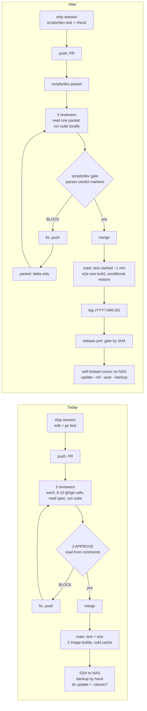
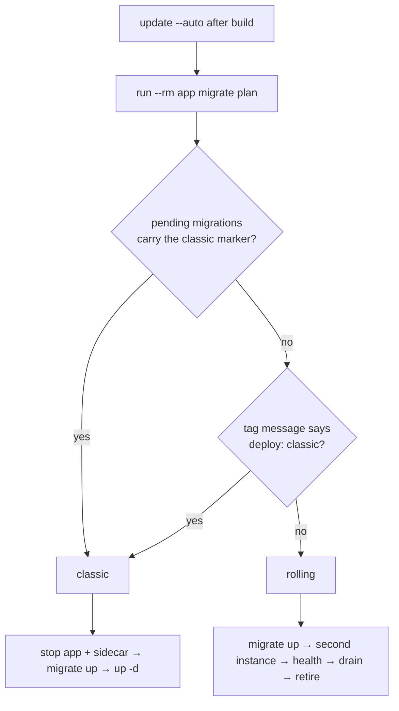
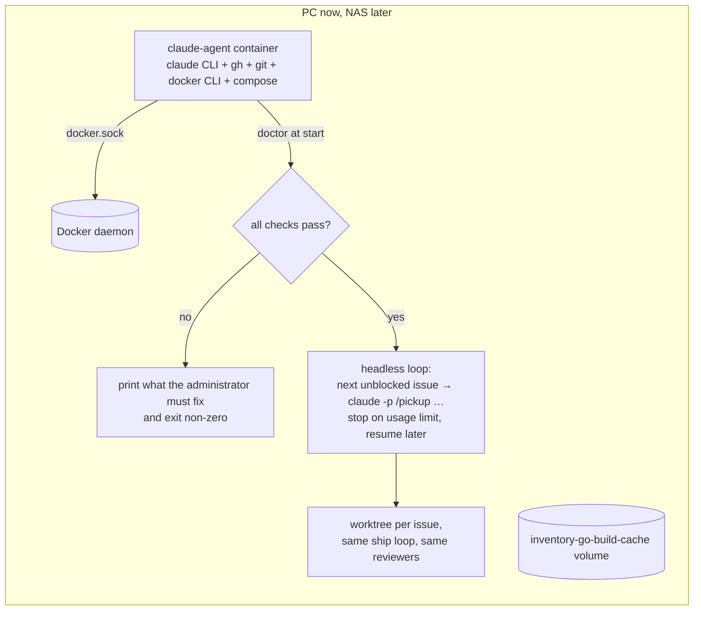
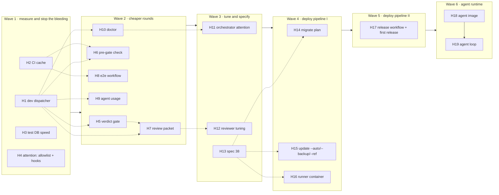

# Harness optimization — deliver more with the same resources

**Status:** proposed · **Central issue:** #PLAN_ISSUE · **Wave plan:** `scripts/wellen-harness.json` · **Author:** Claude (Fable 5.1), 2026-09-26, for Tizian's review

This plan covers the *harness* around the product: GitHub Actions, the
three-reviewer ship loop, the wave orchestrator, local test tooling, and the
path from a green `main` to the Synology NAS. The product code is not in
scope, except for one small backend addition the deployment pipeline needs
(`inventory migrate plan`).

It is written for a reviewer who has not been in the room. Every number in it
was measured on 2026-09-26 against `main` at `3409730`; the commands that
produced them are in the appendix so they can be re-run after the work lands.

---

## 0. Summary

Six goals were set:

| Goal | Where the cost is today | What this plan does about it |
|---|---|---|
| Reduce test times | Every run that touches `internal/store` pays ~20 s of database-bound tests; a fresh CI runner recompiles everything (zero cache) | Postgres speed flags on throwaway test databases; Go build cache and image layers persisted in CI; one container invocation instead of two |
| Reduce review time | 40 recent PRs needed 182 reviewer runs (4.6 per PR, minimum is 3); 37 BLOCK verdicts, many for mechanical findings (missing doc comments, stale text) | A deterministic pre-gate catches the mechanical findings before a reviewer sees the PR; a pre-built review packet replaces 6–10 context-gathering tool calls per reviewer; round 2 reviews the delta, not the whole PR; a machine-readable verdict marker makes the merge gate a script |
| CI ≤ 2000 min/month (repo will go private) | ~1 150 billable min/30 days at today's activity, before the 2-core private-runner penalty; E2E builds the production image twice per push to `main` | Cache, concurrency groups, path filters, one image build shared by both E2E jobs, restore round-trip on a cadence, projected ~520 min/30 days |
| Optimize agent time | 227 k tokens of cached context re-read on the *average* Sonnet call; reviewers are 36 % of all Sonnet calls; sessions wait on permission prompts | Compact tool output by default (`scripts/dev`), review packets, delta rounds, an expanded allowlist, notification hooks so a waiting session is noticed |
| Optimize limited agent resources (subscription caps, Tizian's attention) | No token accounting per PR; no signal when a session is stuck; advisor doubles every package session's cost | Token accounting script with a per-PR baseline; heartbeat and stuck-session alerts in the orchestrator; advisor policy by risk; a headless agent container with an environment doctor |
| Automated deployment to a NAS that cannot be reached but can listen | Deploys are an SSH session and `sh deploy/synology/update` by hand; classic-vs-rolling is a human judgement; no backup is taken automatically | A self-hosted Actions runner in a container on the NAS; release tags trigger a gated deploy job that runs the existing update script with `--auto --backup --ref`; classic mode is decided by a migration marker and can be forced from the tag |

The work is cut into **19 packages in 6 waves** (section 8), executed by the
existing wave orchestrator from `scripts/wellen-harness.json`. Waves 1–2 are
quick wins with measurable effect; wave 3 writes the spec the deployment work
implements; waves 4–5 build the deployment pipeline; wave 6 builds the agent
runtime container.

---

## 1. Baseline — where the resources go today

### 1.1 CI minutes

Source: `gh run list` over the 30 days to 2026-09-26. GitHub bills each *job*
rounded up to the next minute, so wall-clock and billable differ.

| Workflow | Runs / 30 d | Avg wall clock | Jobs | Billable est. / 30 d |
|---|---|---|---|---|
| `test` (push to main, PR to main, dispatch) | 310 | 1.4 min | 1 | ~620 min |
| `e2e` (push to main, dispatch) | 88 | 2.3 min (max of two parallel jobs) | 2 (`e2e` ~3.2 min, `restore-round-trip` ~1.6 min) | ~530 min |
| **Total** | | | | **~1 150 min / 30 d** |

Activity is bursty: 85 runs on 2026-09-26 alone, 60 on 09-21. A wave day
can spend 100+ minutes. Nothing is cached: `actions/cache` usage is 0 bytes.
Inside the `test` job the `go vet` step takes 43 s (it builds the dev image
and compiles everything), `go test` 21 s. Inside `e2e`, "Build the images"
is 65 s in *each* of the two jobs, and the builder stage runs `go test ./...`
again (51 s) before it builds the binary.

Going private changes two things: minutes start counting against 2 000 per
month, and `ubuntu-latest` drops from 4 to 2 vCPU for private repositories,
so every job gets slower. Extrapolated naively, today's activity would land
between 1 500 and 1 800 billable minutes — inside the cap, with no headroom
for a busy month or a runaway job (`test` has `timeout-minutes: 15`, `e2e`
20).

### 1.2 Test time (local, Docker Desktop, 24 cores)

`docker compose run --rm app go test ./...` on `main`:

| Run | Wall clock | Notes |
|---|---|---|
| `-count=1` (nothing cached) | 30.8 s | `internal/store` 19.7 s, `internal/migrate` 7.8 s, `internal/httpapi` 2.3 s, `deploy/synology` 2.5 s, everything else < 2 s |
| second run, no changes | 27.4 s | 15 packages `(cached)`; `store` 19.9 s and `migrate` 8.6 s still run because `-count=1` on the previous run left no result to cache |
| third run, no changes | ~6 s | all `(cached)` — the number PR #278 reported |

The build cache from PR #278 removed the *compile* cost. What remains is the
database-bound work: `internal/store` creates one throwaway database and
runs 40 test files against it, `internal/migrate` creates databases
repeatedly. Any PR that touches `internal/store` — most of them — pays those
~28 s on every ship-loop iteration and on every reviewer's own run. Postgres
defaults (`fsync=on`, `synchronous_commit=on`, `full_page_writes=on`) are
tuned for durability that a throwaway database does not need.

The E2E suite: 157 Playwright tests, 34.7 s locally with 12 workers; 66 s
in CI with 2 workers, plus `npm install` (2 s in CI because the image already
has most packages) and the image build.

### 1.3 Review rounds

Source: reviewer comments on the last 40 merged PRs (#212–#279).

| Outcome | PRs | Share |
|---|---|---|
| All three APPROVE in round 1 | 21 | 52 % |
| Needed round 2 | 16 | 40 % |
| Needed round 3 (consolidation PRs with a raised cap) | 3 | 8 % |

182 reviewer runs for 40 PRs → **4.55 reviewer runs per PR**, against a floor
of 3. 37 BLOCK verdicts. Reading the blocking findings on those PRs, the
recurring mechanical classes are: exported identifier without a doc comment,
a doc that still describes the old behaviour, a test that asserts only the
happy path, and scope creep. The first two are catchable by a linter or a
grep before any reviewer runs.

Each reviewer today spends its first 4–8 turns on the same context gathering
(`gh pr view`, `gh issue view`, reading the spec — spec 01 alone is 1 056
lines — `gh pr diff`, then surrounding files), and in round 2 it does all of
it again for the whole PR.

### 1.4 Agent tokens

Source: session transcripts under `~/.claude/projects/C--Users-tizia-Projekte-Inventory*`
modified in the last 3 days (10 main sessions, 59 subagent transcripts),
deduplicated per message, counting only the final usage record of each call
(see `token-usage-accounting` for the three traps).

| Model | Calls | Cache read | Cache write | Output | of which subagents (reviewers) |
|---|---|---|---|---|---|
| Sonnet 5 | 4 575 | 1 037 M | 10.3 M | 3.10 M | 1 645 calls · 221 M cache read · 1.19 M output |
| Opus 5 | 1 130 | 310 M | 3.0 M | 1.17 M | — |

Two readings matter. **The average Sonnet call re-reads 227 k tokens of
cached context** — sessions run long and carry everything they ever read.
Cached input is cheap per token but it is what the 5-hour and weekly caps are
consumed by at volume, so the lever is *context per call*, not calls.
**Reviewers are 36 % of Sonnet calls and 38 % of Sonnet output**: three
adversarial reviewers per PR, 4.55 runs per PR, each rebuilding its context
from scratch.

### 1.5 Attention

Not measurable from transcripts, but the failure modes are known from this
project's own history: a session waiting on a permission prompt nobody sees;
a session stuck in a loop with no signal to the orchestrator until its issue
never closes; Claude started inside a container that could not reach a
Docker daemon and only found out at the first `docker compose run`; a
consolidation that needed manual conflict work. The orchestrator polls issue
state every 120 s and knows nothing else about a session.

### 1.6 Deployment today

`deploy/synology/update` is a careful rolling update (second app instance,
health check, job drain, sidecar recreation, lock, refusal paths, 21 shell
tests). It is run **by hand over SSH**, after a manual backup, and the
operator decides whether `--classic` is needed by reading the migrations.
There is no runner, no environment, no tag, no deploy key, no secret in the
repository (all checked 2026-09-26). The NAS reaches out (git pull, image
pulls, Tailscale) but is not reachable from GitHub.

---

## 2. Principles and non-goals

- **The no-host-toolchain rule stays absolute.** Every new tool runs inside
  the dev image or a pulled image. Linters are installed in the Dockerfile's
  `dev` stage, pinned by version.
- **Specs stay the contract.** Work that changes an operations guarantee
  (deployment, upgrades, CI semantics) is specified first (spec 38, spec 01
  and 18 amendments) and implemented second. This document is not a contract
  (see `docs/plans/README.md`).
- **Every PR still gets all three reviewers.** Models and efforts may be
  tuned; the test reviewer runs the suite locally and uses CI only when a
  local Docker daemon is genuinely unavailable — never to save a local run.
- **Measure, then change, then measure again.** Every package that claims a
  saving states the before/after number in its PR body using the commands in
  the appendix.
- **Shared files are edited by section.** Packages in one wave touch
  `CLAUDE.md`, `.claude/skills/ship/SKILL.md`, the reviewer prompts and spec
  01 only in the section they own, appending rather than reflowing, so
  parallel PRs merge without conflicts (convention in the wave file).
- **Non-goals:** publishing images to a registry (decided against); zero
  downtime on the NAS (the Tailscale sidecar swap keeps a few seconds of gap,
  as documented); replacing the PowerShell orchestrator (the headless loop is
  an additional entry point); changing the product.

---

## 3. Target architecture

### 3.1 The loop today and after



### 3.2 Deployment pipeline

```mermaid
sequenceDiagram
  autonumber
  participant Dev as Tizian / scripts/dev release
  participant GH as GitHub (hosted runner)
  participant RN as Runner container on NAS
  participant UP as deploy/synology/update
  participant ST as Inventory stack (app, db, sidecar)

  Dev->>GH: git push tag v2026.09.30 (annotated; may say "deploy: classic")
  GH->>GH: release.yml gate job: find successful test + e2e runs for this SHA
  alt no green run for this SHA
    GH->>GH: run test and e2e reusable workflows on the tag
  end
  GH-->>RN: job "deploy" queued for runs-on [self-hosted, nas] (runner long-polls; nothing reaches the NAS)
  RN->>UP: sh deploy/synology/update --ref v2026.09.30 --auto --backup
  UP->>ST: git fetch + checkout tag (clean-clone check), build image with VERSION=tag
  UP->>ST: docker-compose run backup (pre-upgrade archive, keep last N)
  UP->>ST: run --rm app migrate plan → rolling | classic (+ tag override)
  alt rolling
    UP->>ST: migrate up, 2nd instance, /healthz, drain, retire old, recreate sidecar
  else classic
    UP->>ST: stop app + sidecar, migrate up, up -d
  end
  UP-->>RN: exit code, summary (mode, backup archive, version served)
  RN-->>GH: job status, deployment record in environment "production"
  GH-->>Dev: notification on failure; /healthz reports the tag
```

The runner container (`deploy/synology/runner/`) is GitHub's
`actions/runner` image plus `git`, the Docker CLI and a pinned standalone
`docker-compose` ≥ 2.24 — the same tools the update script already expects.
It mounts `/var/run/docker.sock` and the clone at **the same path as on the
host** (`/volume1/docker/inventory`), so the relative bind mounts in
`docker-compose.nas.yml` resolve to the right host directories. It is a
separate Compose project (`inventory-runner`) so `dc down` on the app stack
never touches it. Until the repository is private, `release.yml` is the
*only* workflow allowed to target the runner, it triggers only on tag pushes
(which forks cannot make), and it checks `github.repository` and
`github.actor` before running anything.

### 3.3 Classic or rolling?



A migration carries the marker when the *previous* release's binary cannot
serve against the schema it produces: dropping or renaming a column or table
the previous binary reads, adding `NOT NULL` without a default, changing a
column type, or any rewrite the previous release would misread. The marker
is a comment line the review-go agent is told to look for on every migration
in a diff, so the decision is made in review, by a human-readable line, not
at 03:00 on the NAS. `inventory migrate plan` is the single place that reads
it: it lists pending migrations, prints `rolling` or `classic`, and its exit
code lets the update script branch without parsing text. Spec 38 fixes the
exact syntax (decision D3).

### 3.4 Agent runtime container and doctor



`scripts/doctor` is the same check on the host: daemon reachable, Compose
≥ 2.24, a container can actually start, the external build-cache volume
exists (or is created), ports free, `gh auth status` with the scopes the
loop needs, git identity and LF settings, `claude` on PATH and authenticated,
disk space. It prints one remediation line per failure — the message the
container-without-rights incident lacked — and the orchestrator runs it
before it opens a single window.

---

## 4. Workstreams

Each workstream lists its packages (H-numbers map to the issues and to
`scripts/wellen-harness.json`). Effort estimates are in reviewer-round terms
because that is what the budget is measured in.

### A — CI minutes and speed

**A1 · H2 `h2-ci-cache` — cache the test job, run it once, cancel stale runs.**
`test.yml`: create the external build-cache volume as a bind to a runner
directory saved by `actions/cache` (key: OS + `go.sum` hash + SHA, prefix
restore); build the dev image with BuildKit's GitHub Actions cache so the
`go mod download` layer is restored instead of rebuilt; one
`docker compose run --rm app sh -c 'go vet ./... && go test ./...'` instead of
two container starts; `concurrency: test-${{ github.ref }}` with
`cancel-in-progress` for pull requests; `timeout-minutes: 15 → 8`; a
`paths-ignore` for documentation-only changes handled per decision D7. Spec
01's "Continuous integration" section is updated to describe the cached job.
*Expected:* 1.4 min → ≤ 1 min wall clock on a 2-core runner, billed 1 min
instead of 2; fewer runs through cancellation. *Measure:* average job time
over the next 30 runs.

**A2 · H8 `h8-e2e-workflow` — one image build, cached node modules, restore
round-trip on a cadence.** `e2e.yml`: a `build` job builds the production
image once and hands it to both jobs (`docker save` artifact or BuildKit
cache — the package measures both and keeps the faster); `e2e/node_modules`
cached by `package-lock.json` hash; `restore-round-trip` runs per decision D8
instead of on every push; concurrency group per ref; timeouts tightened.
*Expected:* ~6 billed min per push to `main` → ~3. *Measure:* billed minutes
per `e2e` run.

**A3 · H17 (part) — release gate reuses green runs.** `release.yml` looks up
successful `test` and `e2e` runs for the tag's commit before running anything;
a release from an already-green `main` costs no hosted minutes beyond the
lookup job. Self-hosted minutes are free of charge.

**Considered and not done: sharding the Playwright suite across runners.**
Tizian raised it as a trade of minutes for wall clock. The suite is 66 s of
a 3.2-minute job; the other 2.5 minutes are fixed per job (checkout, image,
migrate, stack, teardown) and every job is billed rounded up to a full
minute, so two shards would cost ~5 billed minutes to save ~30 s of wall
clock, and four shards ~8 minutes to save ~50 s. E2E is not on the PR path,
so nobody waits on its wall clock today; the one place it could matter — a
release tag whose commit has no green run yet — is covered by the gate
reusing `main`'s run. Revisit only if E2E ever becomes a per-PR gate.

**A4 · H1 (part) — `scripts/dev ci-usage`.** Prints billable minutes per
workflow for the current month and a projection against the 2 000 cap, from
the same API this baseline used, so the number is one command away instead
of a spreadsheet.

### B — Test time

**B1 · H3 `h3-test-db-speed` — Postgres flags on throwaway databases.**
`synchronous_commit=off`, `fsync=off`, `full_page_writes=off` on the `db`
service of the E2E stack and the CI test stack; the local dev override per
decision D5 (a developer's staging data lives on that volume). The package
measures `internal/store` and `internal/migrate` before and after and records
both numbers in its PR. *Expected:* `store` 20 s → under 10 s, `migrate`
8 s → under 4 s, cutting the "touched store" ship-loop iteration from ~28 s
to ~12 s. *Not done:* tmpfs for the data directory locally (it would discard
dev data on every `down`); it is applied in CI where the database is
disposable anyway.

**B2 · H1 `h1-dev-dispatcher` — `scripts/dev`, the one command agents run.**
A POSIX `sh` dispatcher (`scripts/dev <command>`) over `scripts/dev.d/<command>`
files, so later packages add commands without editing a shared script.
Wave 1 ships `test [pkg…]` (full log to `.claude/last-test.log`, only
FAIL/panic lines and the last three lines on stdout — the pattern the ship
skill already prescribes, now in one place), `vet`, `ci-status <sha>` (the
dispatch-and-poll recipe that is currently copied into three files), and
`ci-usage`. The ship and pickup skills point at it. *Expected:* fewer
tokens per test run (a green suite is three lines), fewer mistakes in the
poll recipe, one place to fix.

### C — Review time and rounds

**C1 · H6 `h6-pre-gate` — `scripts/dev check`, the deterministic gate.**
`gofmt -l`, `go vet`, `staticcheck`, `revive` with the exported-doc-comment
rule (the single most frequent docs-review BLOCK), a Go test that asserts
`.env.example` names every key `internal/config` reads and nothing else, and a
check that every `docs/specs/*.md` referenced from an issue-style pointer
exists. Tools are pinned in the Dockerfile `dev` stage. Runs in the ship
loop before the first push and as the first step of the `test` job.
*Expected:* the mechanical BLOCK classes disappear from round 1; the
round-1 approval rate rises from 52 % towards the 75 % target.

**C2 · H7 `h7-review-packet` — one file instead of ten calls.**
`scripts/dev packet <PR>` writes `.claude/review-packet.md`: PR title and
body, issue body, the spec sections the issue names (with their acceptance
criteria) rather than the whole spec, `git diff --stat`, the diff, the list
of exported identifiers added or changed and whether they carry a doc
comment, test files changed, and the current CI status by SHA. The three
reviewer prompts start with "read the packet"; their `maxTurns` drop per
decision D2. *Expected:* 4–8 fewer turns per reviewer per round and a
smaller context per call; measured with `scripts/dev agent-usage` on the
reviewer transcripts before and after.

**C3 · H5 `h5-verdict-gate` — machine-readable verdicts and a scripted gate.**
Each reviewer appends an HTML comment `<!-- verdict: APPROVE|BLOCK round=N
sha=<head> reviewer=go|tests|docs -->` to its post. `scripts/dev gate <PR>`
reads the comments, finds the current round for the PR's head SHA and prints
`MERGE` or the missing/blocking reviewers. The ship skill's step 6 calls it
instead of asking the session to re-read every comment into context — which
also removes the "generous memory" failure the skill warns about.

**C4 · H12 `h12-reviewer-tuning` — models, efforts, delta rounds.** Applies
decision D2 (which reviewer runs on which model and effort) and D9 (round 2
verifies the round-1 findings and reviews the delta since the last reviewed
SHA). Validated by replaying the tuned reviewers on six past PRs — three that
were blocked in round 2, three approved in round 1 — and comparing verdicts;
the results table goes into this plan.

### D — Agent time, subscription caps, attention

**D1 · H4 `h4-attention` — allowlist and notifications.** Scan the recent
transcripts for the commands sessions actually run and add the read-only and
loop-standard ones to `.claude/settings.json` (`gh run *`, `gh workflow run`,
`gh api` reads, `gh pr checks`, `gh issue comment/edit`, `git fetch/worktree/
rev-parse/ls-remote/merge`, `docker compose logs/ps/exec/config`, `docker
volume create/ls/inspect`, `scripts/dev *`). Keep the deny list. Add a
`Notification` hook that raises a Windows toast when a session waits for
input, and a `Stop` hook that raises one when a session ends, so a blocked
session is seen within seconds instead of at the next glance at nine
windows.

**D2 · H9 `h9-agent-usage` — token accounting.** `scripts/dev agent-usage
[--since <date>] [--pr <n>]`: the transcript parser used for the baseline
(deduplicated, final-record-only, per model, main vs subagent), plus a per-PR
view by matching a session's worktree branch to its PR. The baseline in
section 1.4 becomes the first row of a table this command keeps up to date.

**D3 · H11 `h11-orchestrator-attention` — the orchestrator notices.** Runs
`scripts/doctor` in its pre-flight (replacing the inline `docker info` check);
tracks a heartbeat per package session (last commit on the package branch,
`.claude/worklog.md` mtime, last PR comment) and logs plus toasts a warning
when nothing moved for a configurable time; records how many review rounds
each package used. Tested in `scripts/tests/wellen-orchestrator.test.ps1`.

**D4 · advisor policy** — decision D1, applied in `scripts/wellen-harness.json`
and recorded in `scripts/wellen-planen.md`.

**D5 · H10 `h10-doctor`, H18 `h18-agent-image`, H19 `h19-agent-loop` — the
agent runtime.** Section 3.4. `scripts/doctor` first (wave 2, host and
container), then the image (`deploy/agent/Dockerfile`: `claude` native
install, `gh`, `git`, Docker CLI with the Compose plugin, non-root user with
the socket's group, auth via `CLAUDE_CODE_OAUTH_TOKEN` and `GH_TOKEN` or
mounted config directories, entrypoint runs the doctor), then the loop
(`scripts/agent-loop.sh`: next unblocked issue → one headless `claude -p`
session per issue with `--max-turns`, structured output logged, stop on a
usage-limit response and resume after the window; per decision D10 either a
`-Headless` switch on the PowerShell orchestrator or a Linux-side entry point
over the same wave JSON). PC first; the image is `linux/amd64` so the DS923+
can run it later (slower tests, no PC needed overnight).

### E — Deployment

**E1 · H13 `h13-spec-38` — the contract.** `docs/specs/38-release-pipeline-and-nas-runner.md`:
release tags (`vYYYY.MM.DD[.n]`, annotated; `VERSION` is stamped from the tag
so `/healthz` reports it); the gate ("a tag deploys only a commit with
successful `test` and `e2e` runs"); the runner container and its security
posture (public-repo phase and private phase); `update --ref`, `--auto`,
`--backup` with retention; the migration marker and `migrate plan` contract;
the tag override; what a failed deploy leaves behind (the update script's
existing guarantees, restated per phase); the going-private checklist (read-
only deploy key on the NAS for `git fetch`, Actions permissions, runner
group, secrets none); rollback (restore the pre-upgrade backup — spec 18's
rule, now taken automatically). Specs 00, 01 ("Deployment model", "Continuous
integration") and 18 ("Upgrades") are amended to point at it;
`migrations/README.md` gets the marker section.

**E2 · H14 `h14-migrate-plan` — the backend piece.** `inventory migrate plan`
in `cmd/inventory` and `internal/migrate`: lists pending migrations, reads
the marker, prints the mode, exits per D3. Tests cover: no pending, pending
without marker, pending with marker, marker in an already-applied migration
(ignored), malformed marker (refused). `review-go.md` gets one checklist line:
"a migration the previous binary cannot serve carries the classic marker".

**E3 · H15 `h15-update-auto` — the script.** `deploy/synology/update` gains
`--ref <tag|sha>` (fetch, verify the ref exists, detached checkout, same
clean-clone refusal, `VERSION` from the ref), `--auto` (run `migrate plan`
after the build and pick rolling or classic; `DEPLOY_MODE=classic` forces),
`--backup` (run the `backup` service before `migrate up`, abort the update if
it fails, keep the newest N archives), and a final summary line the runner
can put in its job summary. Every path gets a case in `update_test.go`
(21 tests today, all stub-driven) plus the scratch-stack table in
`deploy/synology/README.md`. `risk:high`: this script touches production
data.

**E4 · H16 `h16-runner-container` — the listener.** `deploy/synology/runner/
Dockerfile`, `docker-compose.runner.yml`, README: registration per decision
D4, labels `self-hosted,nas,inventory`, one job at a time, restart policy,
state directory, exact mounts, and a smoke test (`docker-compose config`,
`git --version`, socket reachable) the image runs at start. Built in CI only
when its files change (path filter), so it costs nothing on ordinary pushes.

**E5 · H17 `h17-release-workflow` — the trigger.** `.github/workflows/
release.yml`: `on: push: tags: ['v*']`; job `gate` on a hosted runner
(lookup by SHA, else run the reusable `test`/`e2e` workflows); job `deploy`
with `runs-on: [self-hosted, nas]`, `environment: production`, `concurrency:
deploy-nas`, `needs: gate`, no checkout (it runs the clone's own script),
tag-message override → `DEPLOY_MODE`, post-deploy `/healthz` version
assertion, job summary. `scripts/dev release <tag>` creates the annotated
tag only from a SHA with green runs and pushes it. The package ends with a
first real release together with Tizian (runner registered, deploy key
installed, one rolling and one forced-classic deploy observed) — the only
step in this plan that needs a person at the NAS.

---

## 5. What changes for the people and agents in the loop

| Who | Before | After |
|---|---|---|
| Ship session | `docker compose run … go test ./... > log; grep …` by hand; reads every reviewer comment | `scripts/dev test`, `scripts/dev check` before push; `scripts/dev gate <PR>` decides |
| Reviewer agents | Gather context with 6–10 calls; re-review the whole PR in round 2 | Read `.claude/review-packet.md`; round 2 verifies own findings + delta; post a verdict marker |
| Orchestrator | Polls issue state; inline `docker info` check | Runs `scripts/doctor`; heartbeat per session; toast on stuck or waiting sessions |
| Tizian | SSH, backup by hand, decide classic, run update, watch | `scripts/dev release v2026.09.30`; a GitHub notification if it failed; `/healthz` shows the tag |
| A new machine or container | Discovers missing rights at the first `docker compose run` | `scripts/doctor` says what to fix before anything starts |

---

## 6. Projected effect

| Metric | Baseline | Target after waves 1–2 | Target after wave 5 |
|---|---|---|---|
| CI billable min / 30 d (today's activity, private 2-core) | ~1 150 (public 4-core) → est. 1 500–1 800 private | ≤ 700 | ≤ 550 incl. release gates |
| `test` job billed minutes | 2 | 1 | 1 |
| `e2e` billed minutes per push to `main` | 6 | 3 | 3 |
| Go suite, PR touching `internal/store` | ~28 s | ≤ 12 s | ≤ 12 s |
| Round-1 approval rate | 52 % | ≥ 70 % | ≥ 75 % |
| Reviewer runs per PR | 4.55 | ≤ 3.8 | ≤ 3.5 |
| Reviewer cache-read tokens per round | 221 M / 3 d (baseline) | −40 % | −50 % |
| Permission prompts per package session | unmeasured | ~0 for loop-standard commands | ~0 |
| Time from tag to NAS serving it | manual | — | < 15 min, no SSH |

Targets are commitments to *measure*, not promises; each package's PR
records its own before/after and the final section of this plan collects
them.

---

## 7. Risks and how they are contained

| Risk | Containment |
|---|---|
| A self-hosted runner on a still-public repository executes untrusted code | Only `release.yml` targets the runner; it triggers on tag pushes only (forks cannot push tags to this repository); it checks repository and actor; Actions setting "allow selected actions" and fork-PR approval are part of the going-private checklist; the runner is `linux/amd64` in a container with nothing but the clone and the socket — which is still root-equivalent on the NAS, so the socket mount is the accepted risk, stated in spec 38 |
| `fsync=off` corrupts a developer's staging database | Applied to CI and E2E unconditionally; the local dev override per D5 (`synchronous_commit=off` alone loses only the last transactions on a crash, never integrity) |
| Path filters skip a test run that mattered | Ignore list is short and explicit (`docs/**`, `**/*.md`, `.claude/**`, `scripts/*.ps1`, `scripts/tests/**`, `scripts/*.json`); `deploy/**` and every Go, SQL, compose, Dockerfile and `web/**` change still runs; `cmd/inventory/compose_test.go` and `deploy/synology/update_test.go` read files that stay on the run list |
| Delta review misses a regression the round-2 fix introduced elsewhere | Per D9: review-go re-reads the full diff when the delta touches routing, middleware or store transactions; the test reviewer always runs the whole suite |
| Cheaper reviewer models miss real findings | Replay on six past PRs before the tuning ships (H12); revert is a frontmatter edit |
| `migrate plan` says rolling but the old binary cannot serve | The marker rule is reviewed on every migration diff (review-go checklist); the tag override exists for the case a human knows better; the rolling update's own health check removes a new instance that fails, and the pre-upgrade backup is the rollback |
| Cache poisoning / stale build cache in CI | Keys include the `go.sum` hash and the SHA with prefix restore; a wrong cache costs a slower run, never a wrong verdict — Go validates cache entries by content hash |
| The orchestrator's heartbeat produces false "stuck" alerts during long test runs | Threshold configurable per plan; the alert is a toast, never an action |
| Two plans running at once | The harness plan starts only after the follow-ups plan (#176) has closed its last wave; the orchestrator's one-plan rule stands |

---

## 8. Execution — the wave plan

`scripts/wellen-harness.json` (plan issue #PLAN_ISSUE). Standards: Sonnet 5 /
high for packages, Opus 5 / xhigh for consolidation; per package overrides
where the file is `risk:high`; advisor per decision D1; round limit 2 per
package, 4 per consolidation; `dockerCleanup: true` on every wave.



| Wave | Package | Slug | Files it owns | Model / effort | Risk |
|---|---|---|---|---|---|
| 1 | H1 dev dispatcher | `h1-dev-dispatcher` | `scripts/dev`, `scripts/dev.d/{test,vet,ci-status,ci-usage}`, ship skill §3 | Sonnet / high | — |
| 1 | H2 CI cache | `h2-ci-cache` | `.github/workflows/test.yml`, spec 01 "Continuous integration" | Sonnet / high | — |
| 1 | H3 test DB speed | `h3-test-db-speed` | `docker-compose.override.yml` (db), `docker-compose.e2e.yml` (db), spec 01 override section | Sonnet / high | — |
| 1 | H4 attention | `h4-attention` | `.claude/settings.json`, `scripts/hooks/*`, `scripts/wellen-planen.md` (hooks note) | Sonnet / high | — |
| 2 | H5 verdict gate | `h5-verdict-gate` | `scripts/dev.d/gate`, reviewer prompts (Output section), ship skill §6 | Sonnet / high | — |
| 2 | H6 pre-gate | `h6-pre-gate` | `scripts/dev.d/check`, Dockerfile dev stage, `test.yml` (one step), ship skill §3 (one line), `internal/config` parity test | Sonnet / high | — |
| 2 | H7 review packet | `h7-review-packet` | `scripts/dev.d/packet`, reviewer prompts (Task section), ship skill §5 | Sonnet / high | — |
| 2 | H8 e2e workflow | `h8-e2e-workflow` | `.github/workflows/e2e.yml`, `docker-compose.e2e.yml` (e2e service), spec 01 E2E paragraph | Sonnet / high | — |
| 2 | H9 agent usage | `h9-agent-usage` | `scripts/dev.d/agent-usage`, this plan §1.4 | Sonnet / high | — |
| 2 | H10 doctor | `h10-doctor` | `scripts/doctor`, `scripts/dev.d/doctor`, README section | Sonnet / high | — |
| 3 | H11 orchestrator attention | `h11-orchestrator-attention` | `scripts/wellen-orchestrator.ps1`, its test, `scripts/wellen-planen.md` | Sonnet / high | — |
| 3 | H12 reviewer tuning | `h12-reviewer-tuning` | reviewer prompts (frontmatter + round rule), ship skill §7, this plan (replay table) | Opus / xhigh | judgement |
| 3 | H13 spec 38 | `h13-spec-38` | `docs/specs/38-*.md`, specs 00/01/18 pointers, `migrations/README.md` | Opus / xhigh | contract |
| 4 | H14 migrate plan | `h14-migrate-plan` | `cmd/inventory/main.go`, `internal/migrate/*`, `review-go.md` (one line) | Sonnet / high | — |
| 4 | H15 update --auto | `h15-update-auto` | `deploy/synology/update`, `update_test.go`, `deploy/synology/README.md` | Opus / xhigh | `risk:high` |
| 4 | H16 runner container | `h16-runner-container` | `deploy/synology/runner/*`, `test.yml` (path-filtered build job) | Opus / xhigh | `risk:high` |
| 5 | H17 release workflow | `h17-release-workflow` | `.github/workflows/release.yml`, `scripts/dev.d/release`, README runbook, spec 38 acceptance | Opus / xhigh | `risk:high` |
| 6 | H18 agent image | `h18-agent-image` | `deploy/agent/*` | Sonnet / high | — |
| 6 | H19 agent loop | `h19-agent-loop` | `scripts/agent-loop.sh`, orchestrator (`-Headless`, per D10), `wellen-planen.md` | Sonnet / high | — |

No package adds a migration; no migration number is reserved. Wave 6 is
sequential (H19 builds on H18). Every other wave runs its packages in
parallel; the shared-file convention in section 2 is in the wave file's
`plan.conventions` so every package prompt carries it.

The plan can start once the follow-ups plan (#176) has closed its last wave
issue — the orchestrator runs one plan at a time. Start command:

```powershell
powershell -NoProfile -File scripts\wellen-orchestrator.ps1 -WaveFile scripts\wellen-harness.json
```

---

## 9. Decision record

Decisions that were not settled with Tizian directly were put to a Fable
advisor with the context above and are recorded here verbatim for review.
Overruling one is an edit to the corresponding issue before its wave starts.

DECISION_RECORD

---

## 10. Settled with Tizian (2026-09-26)

- The repository will go private; 2 000 Actions minutes per month is a hard
  cap to design for.
- Deployment: a self-hosted GitHub Actions runner, in a container on the
  DS923+. No image is published to a registry; the runner runs
  `deploy/synology/update`, which builds on the NAS as today.
- Trigger: an explicit release tag. Every green `main` stays deployable but
  is not auto-deployed.
- Classic-vs-rolling: decided by a marker in the migration file; a keyword
  in the release tag can force classic.
- Reviewers: all three stay on every PR; models and efforts may be tuned;
  the test reviewer runs the suite locally and falls back to CI only when
  local Docker is impossible.
- An environment doctor and a `claude-cli` container that self-tests and can
  run Claude in a loop: PC first, NAS later.
- Subissues are executed as a wave plan for the orchestrator.
- This plan is presented as a draft PR, gets the three adversarial reviewers,
  and is mirrored as a Claude artifact.

---

## 11. How to review this plan

1. Check the baseline (section 1) against the appendix commands; if a
   number looks wrong, the plan's targets are wrong with it.
2. Read the decision record (section 9) — each decision names its reversal
   cost; overrule by editing the issue, not this document.
3. Check the wave table (section 8) for file collisions you know about that
   the collision rules missed.
4. Check the deployment sequence (section 3.2) against how you actually
   operate the NAS: paths, the compose prefix, Task Scheduler, the sidecar.
5. Anything you want added is a new sub-issue under #PLAN_ISSUE; anything
   you want dropped is a close with a comment — the wave file is regenerated
   from the issue list.

---

## Appendix A — Measurement commands

```bash
# CI runs, wall clock per workflow, last 30 days
gh run list --limit 500 --created ">=$(date -d '30 days ago' +%F)" --json name,createdAt,updatedAt \
  -q '[.[] | {name, min: (((.updatedAt|fromdateiso8601)-(.createdAt|fromdateiso8601))/60)}]
      | group_by(.name) | .[] | "\(.[0].name): runs=\(length) total_min=\(map(.min)|add|floor)"'

# Step timing of one run
gh api repos/CDRO/Inventory/actions/runs/<run-id>/jobs \
  --jq '.jobs[] | "\(.name) \(.started_at) -> \(.completed_at)", (.steps[] | "  \(.name): \(.started_at) -> \(.completed_at)")'

# Go suite, per package, uncached then cached
docker compose run --rm app go test -count=1 ./...
docker compose run --rm app go test ./...

# Review rounds on the last 40 merged PRs (see scripts/dev gate once H5 lands)
for pr in $(gh pr list --state merged --limit 40 --json number -q '.[].number'); do
  gh pr view "$pr" --json comments -q '.comments[].body' | awk -v pr="$pr" '
    /^## (Go|Test|Docs) Review/ {c++; if ($0 ~ /VERDICT: BLOCK/) b++}
    /\*\*Round:\*\* *[0-9]+/ {match($0,/\*\*Round:\*\* *[0-9]+/); n=substr($0,RSTART,RLENGTH); gsub(/[^0-9]/,"",n); if (n+0>r) r=n+0}
    END {printf "PR %s verdicts=%d blocks=%d rounds=%d\n", pr, c, b, r}'
done

# Token usage, last 3 days (until scripts/dev agent-usage exists, H9):
# deduplicate by message uuid, count only usage records carrying output_tokens,
# take the last usage object on a line — see the token-usage-accounting notes.
```

## Appendix B — Reference facts checked on 2026-09-26

- Repository: public; no branch protection, no rulesets; Actions
  `allowed_actions: all`; default workflow permissions `read`; no runners,
  environments, tags, deploy keys or secrets.
- Hosted runners: `ubuntu-latest` is 4 vCPU for public repositories and
  2 vCPU for private ones; each job is billed rounded up to the minute;
  self-hosted runner minutes are not billed.
- NAS: DS923+ (x86_64), Container Manager, standalone `docker-compose` ≥ 2.24,
  clone at `/volume1/docker/inventory`, `docker-compose -p inventory -f
  docker-compose.yml -f docker-compose.nas.yml` on every call, Tailscale
  sidecar shares the app's network namespace.
- Local: Docker Desktop, 24 CPU, 32 GB; the external volume
  `inventory-go-build-cache` exists.
